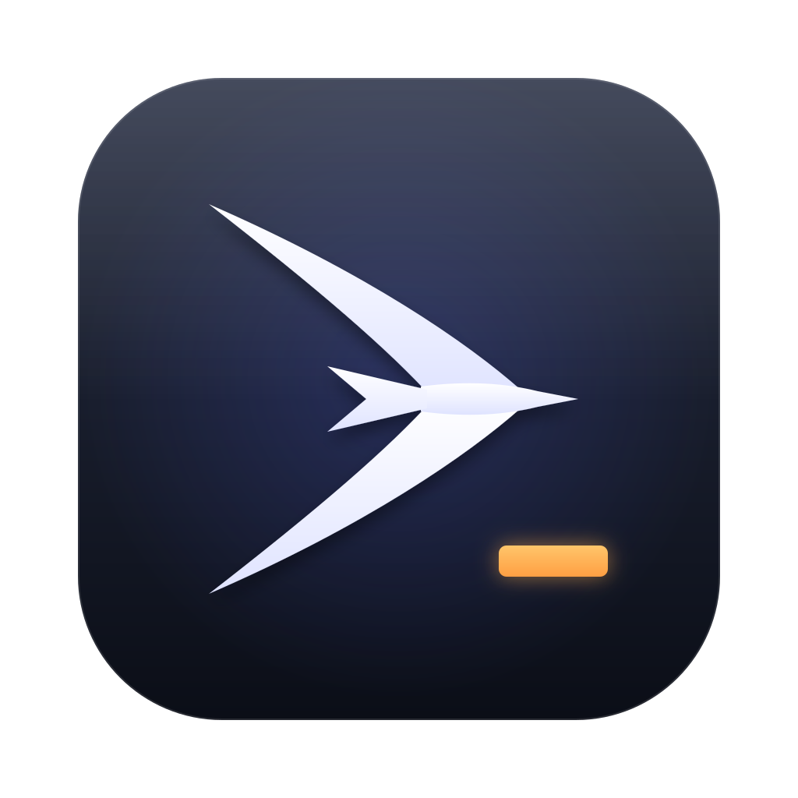
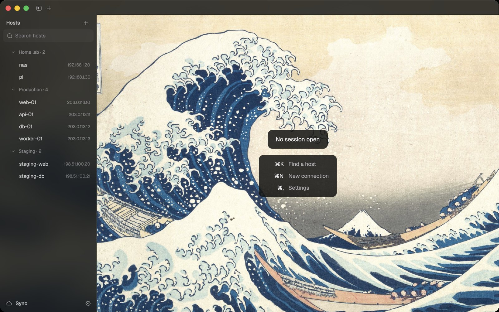
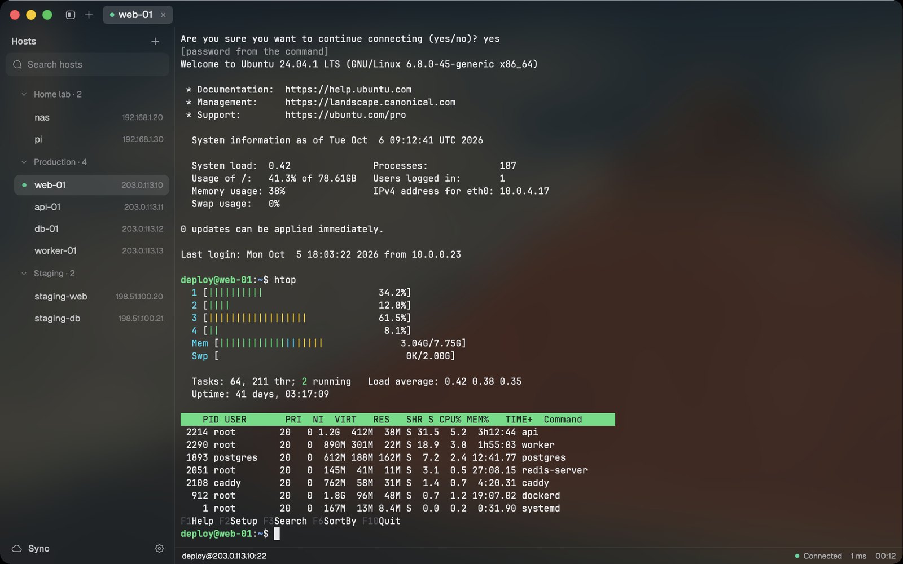
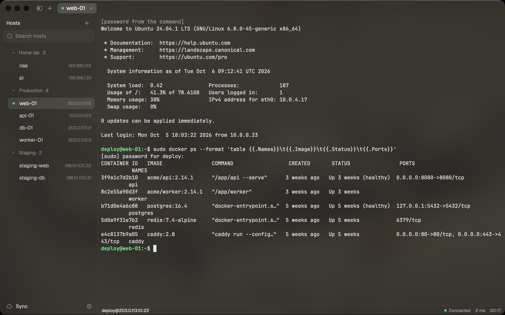
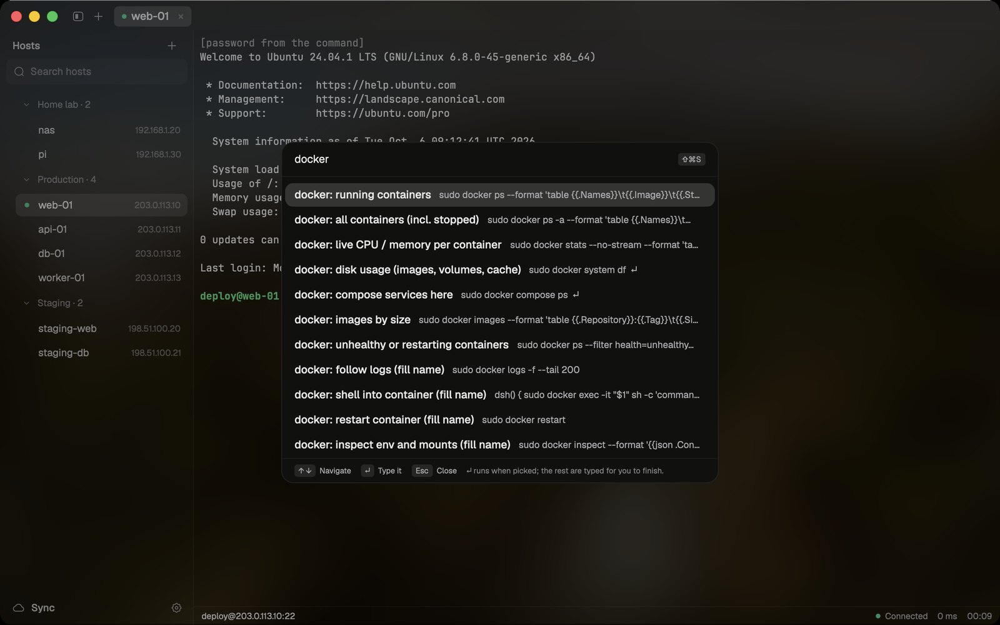
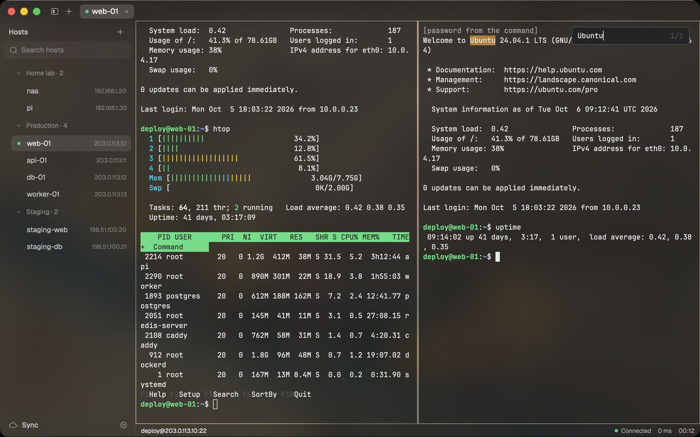
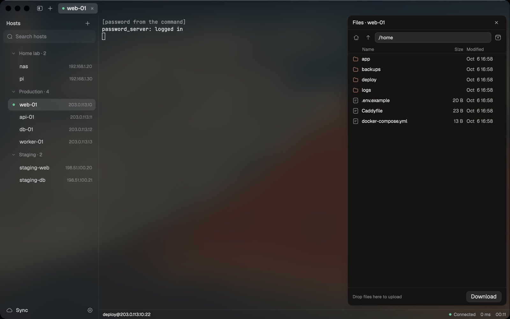
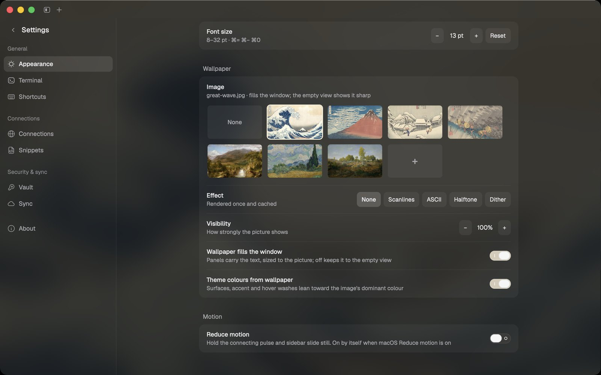
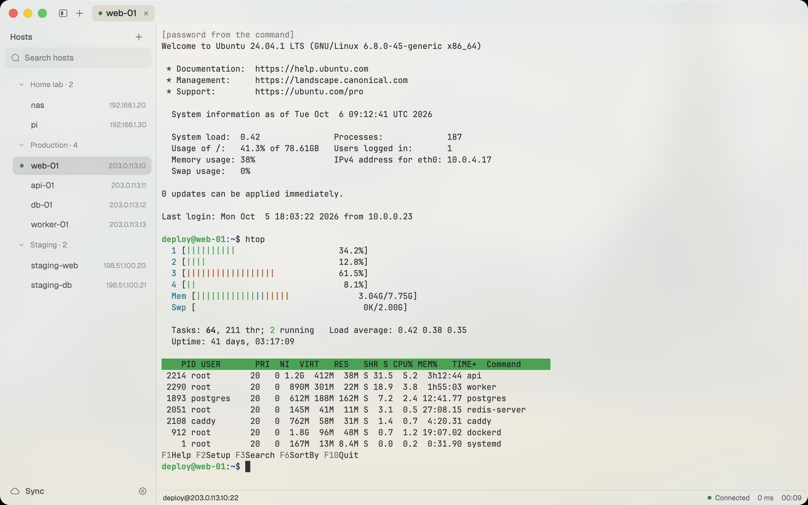

<p align="center">
  
</p>

<h1 align="center">tern</h1>

<p align="center">
  A fast, native SSH client for macOS, written in Rust on <a href="https://github.com/zed-industries/zed/tree/main/crates/gpui">GPUI</a>.<br>
  Your servers one click away, passwords that fill themselves, and a window you'll enjoy looking at.
</p>

<p align="center">
  
</p>

## Why tern

- **One click to a shell.** Saved connections in groups, ⌘K to jump to any of them, and a status line with latency and session time.
- **Passwords that stay out of the way.** Logins come from your SSH key, your password manager (`gopass show -o …`), or tern's encrypted vault. At a `sudo` prompt, **⌘\\** types the password for you.
- **Built for real work.** Split panes, find in scrollback, clickable links, snippets, SFTP file browser, port forwards, ProxyJump, agent forwarding, broadcast input, session logs, and automatic reconnect.
- **Your setup, backed up.** Hosts, snippets and settings sync to a private Git repository you own, encrypted end to end.
- **Native and light.** Under 100 MB with a connected session. It reads crisp on 1080p monitors, and sits on frosted glass over a wallpaper of your choice.

<p align="center">
  
</p>

## A closer look

| | |
| --- | --- |
| <br>**⌘\\ fills `sudo`**: the password comes from your password manager, typed only when you ask and only at a password prompt. | <br>**Snippets (⇧⌘S)**: saved commands. ↵ marks the ones that run when picked; the rest are typed for you to finish. |
| <br>**Splits and find**: ⌘D and ⌘⇧D split a tab; ⌘F searches the scrollback. | <br>**Files (⇧⌘O)**: browse the remote side over SFTP; download, or drop files to upload. |
| <br>**Make it yours**: seven public-domain artworks built in, or any image; light, dark or follow macOS; any monospace font. | <br>**Light and dark**: the window takes its colours from the wallpaper, and every text colour stays at least 4.5:1. |

## Features

**Connections**
- Saved connections with groups and tags, search (⇧⌘F), and a ⌘K picker ordered by what you used last.
- Import from `~/.ssh/config` as a one-time copy; tern keeps its own list.
- ProxyJump chains, local, remote and dynamic (SOCKS) port forwards, agent forwarding, and keep-alive per host.
- Automatic reconnect after a network drop, with backoff. It never reconnects after you type `exit`.
- Two-factor (keyboard-interactive) logins, and a hard stop on changed host keys, with the exact `ssh-keygen -R` line to fix one you trust.

**Terminal**
- Tabs you can rename, reorder and reopen on launch; split panes; broadcast input to chosen tabs.
- Find in scrollback, ⌘-click links (including OSC 8), cursor shape and blink, scrollback length, copy on select, and visual bell.
- SFTP browser, session logging to a file, and a status line showing host, state, latency and session time.

**Passwords and keys**
- **Password command** per connection, such as `gopass show -o work/ssh/web-01`. tern runs it when the server asks and never stores the result. A command that arrives through sync must be approved once on each Mac.
- **Vault**: an age-encrypted file for passwords and SSH keys (generate ed25519, import, copy the public key). It unlocks with a PIN or through the macOS Keychain, and locks after you've been idle.
- **⌘\\ Fill password** at `sudo` and other password prompts. It never types on its own.

**Sync**
- To a private Git repository through your own `git` and SSH key (or a GitHub gist). Everything is encrypted with your vault passphrase before it leaves the Mac.
- It runs on its own when something changes and every few minutes. When both sides changed, it merges per file and per host, and only asks about a real conflict.

**Look**
- zeron-style chrome, tinted to your wallpaper. Panels are frosted glass over one backdrop, and the picture shows sharp in the empty view.
- Light, dark or system appearance. A "sharper text" mode for 1× monitors. Reduce motion follows macOS.

## Keyboard

| Action | Keys | Action | Keys |
| --- | --- | --- | --- |
| Host picker | ⌘K | Split right / down | ⌘D / ⌘⇧D |
| Search hosts | ⇧⌘F | Move between panes | ⌥⌘ + arrows |
| New connection | ⌘N | Find in scrollback | ⌘F |
| Snippets | ⇧⌘S | Fill password | ⌘\\ |
| Browse files | ⇧⌘O | Close pane / tab | ⌘W |
| Settings | ⌘, | Next / previous tab | ⇧⌘] / ⇧⌘[ |
| Toggle sidebar | ⌘B | Text size | ⌘= / ⌘− / ⌘0 |

Every shortcut can be rebound in Settings → Shortcuts.

## Install

**Download:** grab `tern-<version>-macos-arm64.zip` from [Releases](https://github.com/your-moon/tern/releases), unzip it, and move `tern.app` to Applications. Releases are signed with a Developer ID and notarised by Apple.

**Build from source** (Rust 1.99+, macOS on Apple silicon):

```sh
git clone https://github.com/your-moon/tern && cd tern
scripts/make-local-identity.sh   # once: a stable local signature, so Keychain access survives updates
scripts/bundle-app.sh            # builds target/release/bundle/tern.app
cp -R target/release/bundle/tern.app /Applications/
cargo install --locked --path crates/tern   # the `tern` command (tern <host>, tern vault init)
```

## Security

- Host keys are checked against `~/.ssh/known_hosts`. A changed key refuses the connection.
- Secrets live in the vault (age, scrypt) or in your password manager. They are never written to logs, and never typed into the terminal unless you press ⌘\\.
- Sync data is encrypted before it leaves your Mac. The repository only ever sees `.age` files.
- Report vulnerabilities privately, as described in [SECURITY.md](SECURITY.md).

Losing a Mac doesn't lose your setup: see [docs/recovery.md](docs/recovery.md).

## Design and development

- [Architecture](docs/architecture.html), [UI spec](docs/ui.md), [performance](docs/perf.md), and the [craft rules](CRAFT.md) every change passes.
- `cargo test --workspace` runs the suite, including SSH tests against an in-process server. `cargo run -p tern-ssh --example password_server -- --demo` starts the demo server used for these screenshots.

## Credits

tern copies and adapts code from well-maintained projects rather than reinventing it, and each copied file names its origin. The full list is in [NOTICE.md](NOTICE.md).
- **Code:** [zeron](https://github.com/zeronsh/zeron)'s UI (MIT), [russh](https://github.com/Eugeny/russh) (Apache-2.0), [alacritty_terminal](https://github.com/alacritty/alacritty) (Apache-2.0) and Zed's GPUI.
- **Assets:**
  - icons from Solar by 480 Design (CC BY 4.0) and Geist fonts (OFL);
  - terminal themes from [iTerm2-Color-Schemes](https://github.com/mbadolato/iTerm2-Color-Schemes);
  - built-in wallpapers from [The Met Open Access](https://www.metmuseum.org/about-the-met/policies-and-documents/open-access) (CC0): Hokusai, Hiroshige, Church, Van Gogh and Rousseau.

## License

[GPL-3.0](LICENSE).
